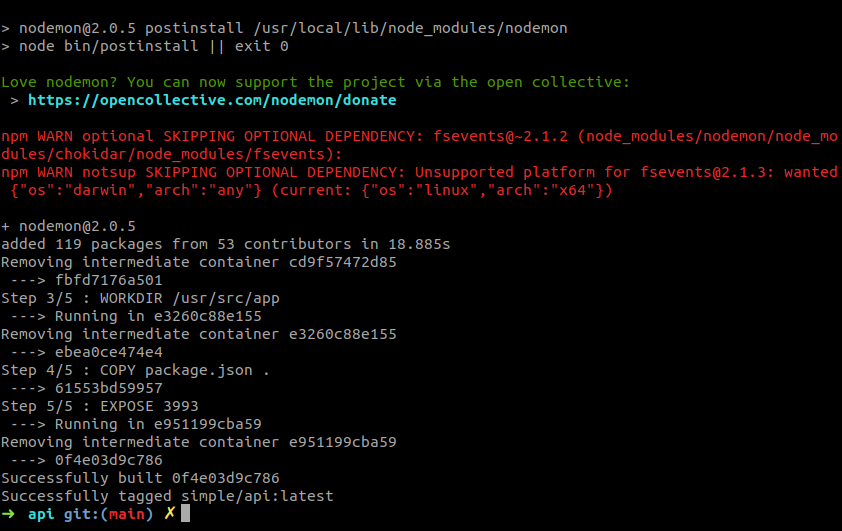
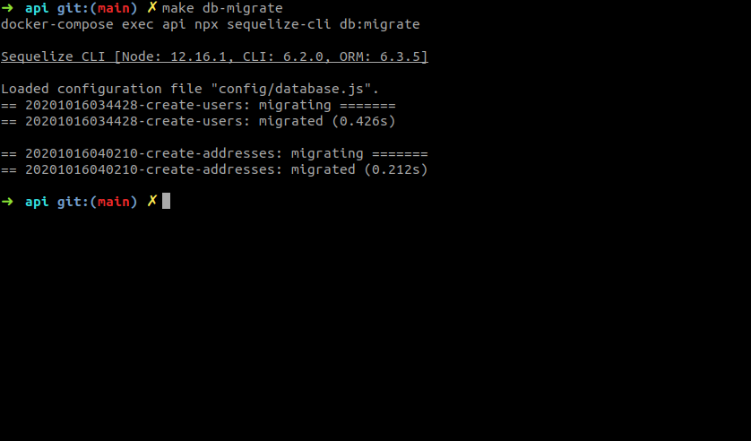
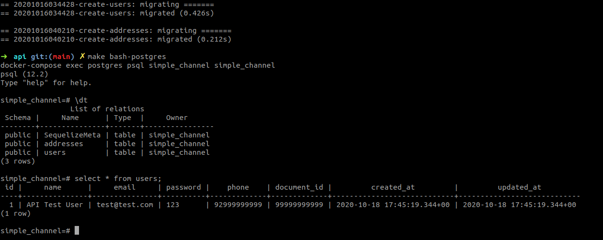

# Configurando a API

A API foi desenvolvida completamente em Javascript com o uso dos frameworks [NodeJS](https://nodejs.org/en/) e [ExpressJS](https://expressjs.com/pt-br/), e isso normalmente exigiria que você os tivesse instalado em seu ambiente de desenvolvimento para poder executar nosso `Backend`. No entanto, visando simplificar todo esse processo, além de facilitar ainda mais o desenvolvimento do mesmo, tudo foi desenvolvido e configurado dentro de containers [Docker](https://www.docker.com/), o que reduziu o processo de configuração somente a `"dockerização"` do seu ambiente de desenvolvimento.

## Índice

* [Requisitos](#requisitos)
* [Instalando as dependências](#instalando-as-dependências)
* [Executando](#executando)
* [Preparando o Banco de Dados](#preparando-o-banco-de-dados)
* [Testando com o Postman](#testando-com-o-postman)
* [Visualizando os dados](#visualizando-os-dados)

## Requisitos

Esta documentação considera que você está rodando seu ambiente de desenvolvimento em uma distribuição `Linux` (Preferencialmente [Ubuntu 18.04 ou superior](https://ubuntu.com/download/desktop)) e já possui o `Docker` e `Docker Compose` previamente instalado e configurado. No entanto, caso você não esteja usando o `Linux` não se preocupe pois o `Docker` pode ser configurado em qualquer Sistema Operacional, basta seguir a seguinte documentação que é bem fácil de configurá-los:

* (Opicional) [Docker](https://www.docker.com/get-started)
* [Docker For Ubuntu](https://docs.docker.com/engine/install/ubuntu/)
* [Docker Compose For Ubuntu](https://docs.docker.com/compose/install/)

Por favor, certifique-se de instalar as versões mais recentes de ambas ferramentas.

## Instalando as dependências

Para criar todos os containers necessários, toda a configuração do Banco de Dados e sua comunicação coma API basta seguir os seguintes passos:

* Abra um terminal de comando pressionando `ctrl + alt + t`
* Entre no diretório do projeto `simple-channel` onde você clonou o projeto
* Execute `cd api` para entrar no diretório da `simple-channel/api/`
* Execute `make build` ou `make build-no-cache` para instalar a API e suas dependências. O segundo comando é mais demorado mas vai força a reinstalação de tudo
* Verifique se os 5/5 passos da build foram concluídos:

## Executando

Para rodar a API e subir todos os containers necessários basta seguir os seguintes passos:

* Abra um terminal e entre no diretório `simple-channel/api/`
* Execute `make start` para subir os containers da API e Banco de Dados
* Verifique se a network `api_backend` e os containers `simpre-postgres` e `simple-api` foram criados:

* Execute `make logs-tail` para ver os logs da API em tempo real:

* Verifique se a API está escutando a porta `3993`

## Preparando o Banco de Dados

A API agora está configurada e escutando a porta `3993`. Contudo, seu banco de dados embora exista e esteja corretamente configurado, ainda não possui os relacionamentos necessários. Para criar as tabelas do banco basta seguir os seguintes passos:

* Deixe a API rodando, abra **OUTRO** terminal, e entre no diretório `simple-channel/api/`
* Execute `make db-migrate` para gerar as tabelas necessárias e seus relacionamentos
* Verifique se as migrações de criação de usuários e endereços ocorreram com sucesso:

* Execute `make bash-postgres` para conectar com o banco de dados.
* Execute `\dt` para listar todas as tabelas e view presentes no banco de dados:

* Verifique se todas as tabelas foram criadas corretamente

## Testando com o Postman

Agora a API já está devidamente configurada e pronta para responder requisições. Para testar podemos utilizar a ferramenta [Postman](https://www.postman.com/), uma das ferramentas de teste de APIs mais utilizada do mundo inteiro. Para realizar requisições para a API usando o Postman basta seguir os seguintes passos:

* Instale o [Postman](https://www.postman.com/) no mesmo ambiente de desenvolvimento que você subiu a API. Recomendo fortemente instalar a versão para Desktop pois é mais rápida e estável
* Importe o arquivo `simple-channel/api/postman/simple-channel.postman_environment.json` com as variáveis de ambiente do teste no Postman
* Importe o arquivo `simple-channel/api/postman/simple-channel.postman_collection.json` com os testes das rotas no Postman
* Execute o teste da rota `GET /healthcheck` e verifique se a API está respondendo normalmente:

* Execute o teste da rota `POST /users` e verifique se a API está respondendo normalmente:

* Execute o teste da rota `GET /cep` e verifique se a API está respondendo normalmente:

* Se tudo funcionou corretamente sua API é capaz de cadastrar novos usuários e validar endereços!

## Visualizando os dados

Agora que nos certificamos que a API está funcionando e atendendo requisições como o esperado, podemos também visualizar os dados que ela armazena no banco de dados. Para visualizar os dados do Banco de Dados basta seguir os seguintes passos:

* Deixe a API rodando, abra **OUTRO** terminal, e entre no diretório `simple-channel/api/`
* Execute `make bash-postgres` para conectar com o banco de dados.
* Execute `select * from users;` para visualizar os dados de todos os usuários salvos até o momento no PostgreSQL:

* Execute `select * from addresses;` para visualizar os dados de todos os endereços salvos até o momento no PostgreSQL:

* Execute `\q` para fechar a conexão com o banco e sair
* Sinta-se livre para fazer outras consultas SQL! Divirta-se!