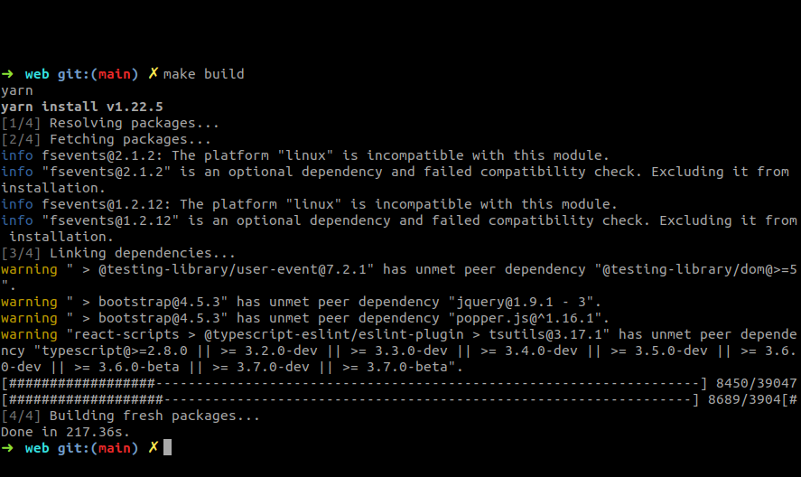
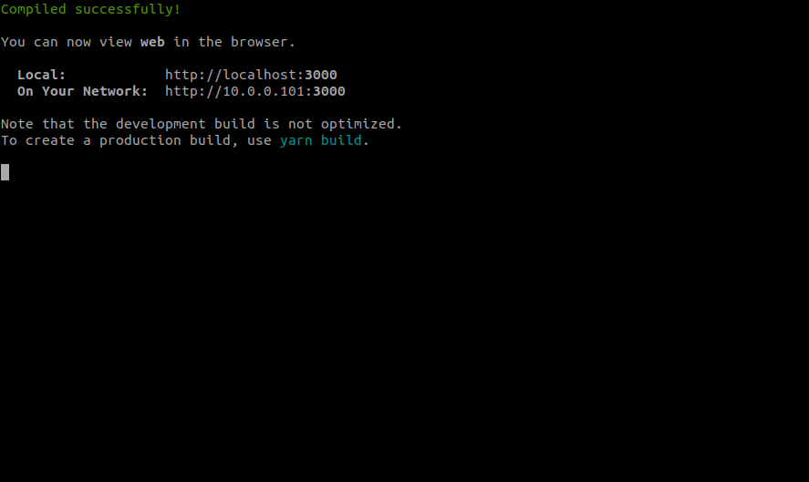
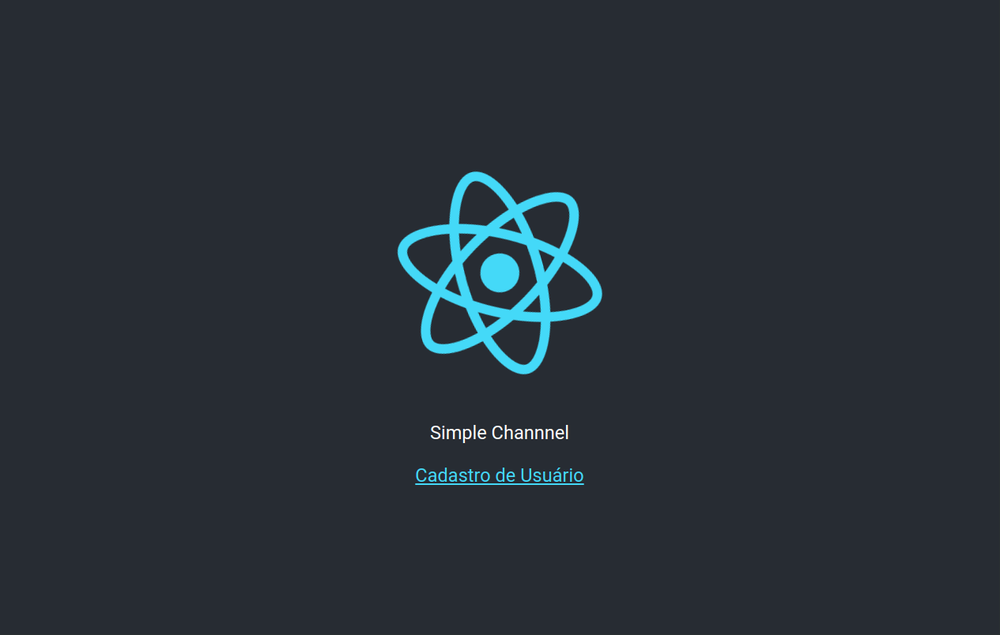
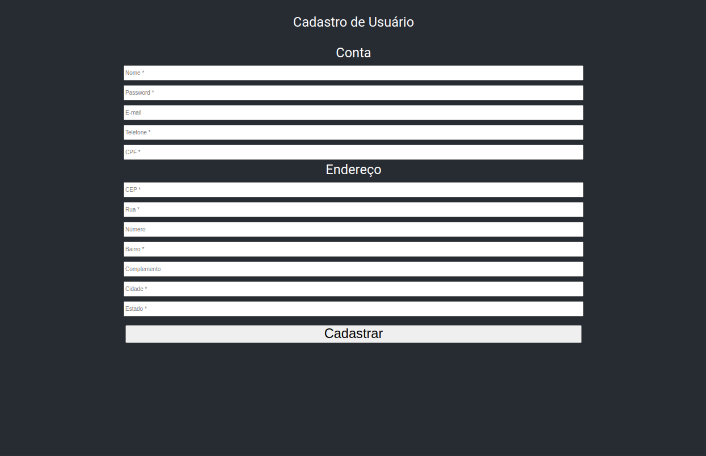
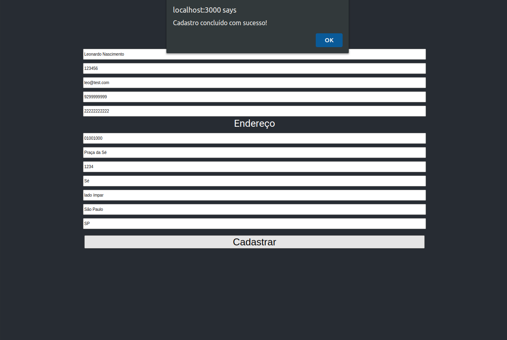
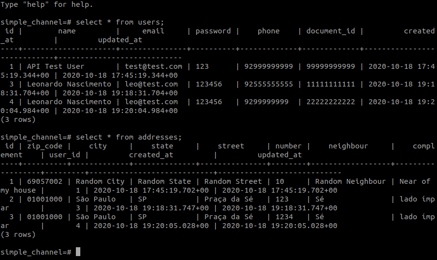
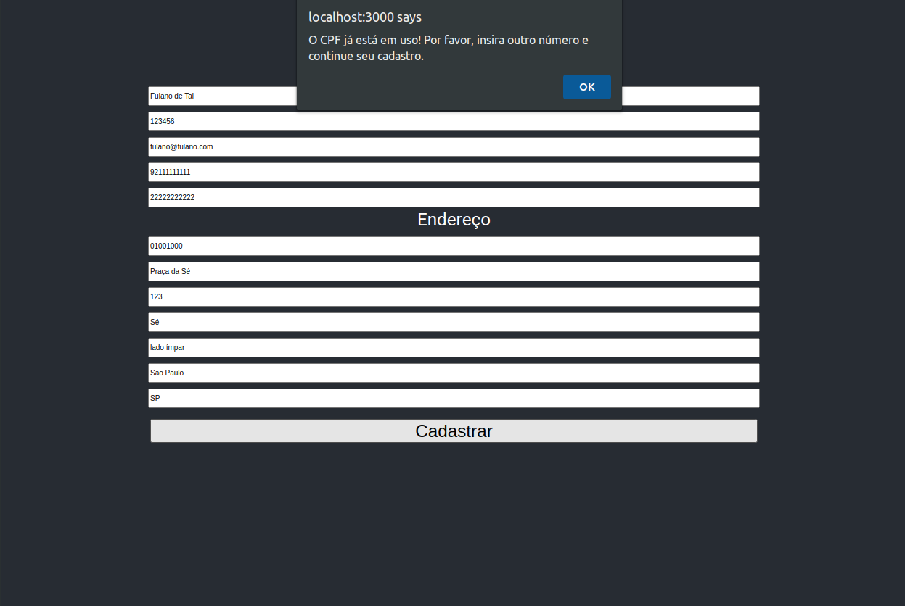
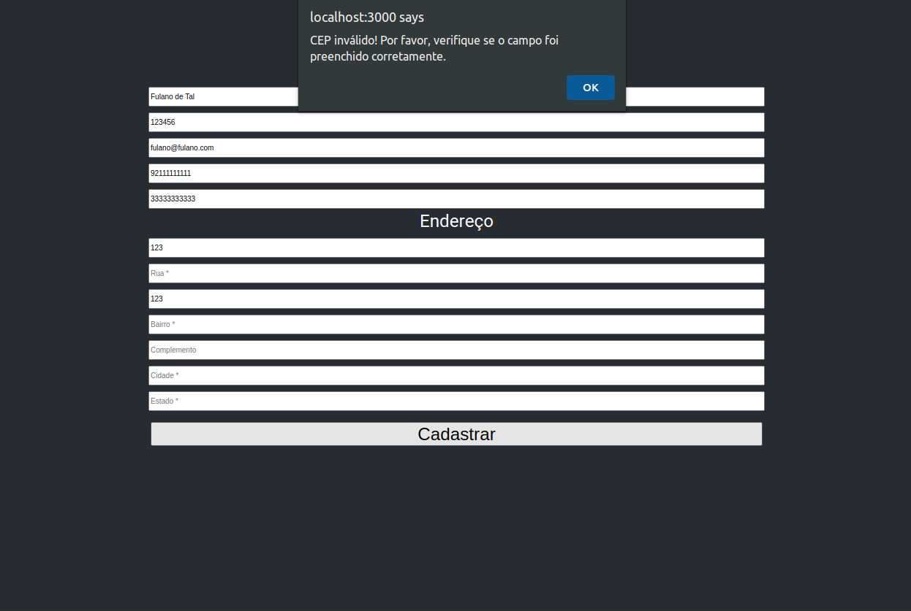

# Configurando o Site

O Site foi desenvolvido completamente em Javascript com o uso dos frameworks [NodeJS](https://nodejs.org/en/) e [ReactJS](https://pt-br.reactjs.org/), e para suportá-lo em seu ambiente de desenvolvimento é necessário a instalação da versão `v11.15.0 ou superior` do `NodeJS` para poder configurar e executar nosso `Frontend`.

## Índice

* [Requisitos](#requisitos)
* [Instalando as dependências](#instalando-as-dependências)
* [Executando](#executando)
* [Utilizando](#utilizando)

## Requisitos

Esta documentação considera que você está rodando seu ambiente de desenvolvimento em uma distribuição `Linux` (Preferencialmente [Ubuntu 18.04 ou superior](https://ubuntu.com/download/desktop)) e já possui o `NodeJS` previamente instalado e configurado. No entanto, caso você não esteja usando o `Linux` não se preocupe pois o `NodeJS` pode ser configurado em qualquer Sistema Operacional utilizando o `Node Version Manager`, basta seguir a seguinte documentação que é bem fácil de configurá-lo:

* [NodeJS com Node Version Manager](https://github.com/nvm-sh/nvm)

Por favor, certifique-se de instalar a versão mais recente do `NodeJS`.

## Instalando as dependências

Para instalar toda a configuração necessária para rodar nossa aplicação `single-page` basta seguir os seguintes passos:

* Abra um terminal de comando pressionando `ctrl + alt + t`
* Entre no diretório do projeto `simple-channel` onde você clonou o projeto
* Execute `cd web` para entrar no diretório da `simple-channel/web/`
* Execute `make build` para instalar o Site e suas dependências (Dependendo da velocidade de conexão com a Internet esse processo pode demorar).
* Verifique se os 4/4 passos da build foram concluídos:

## Executando

Para rodar o Site e subir o webserver basta seguir os seguintes passos:

* Abra um terminal e entre no diretório `simple-channel/web/`
* Execute `make start` para subir a `single-page-application` baseada em `ReactJS`
* Verifique se a aplicação subiu corretamente e está escutando a porta `3000`:

* Verifique se uma página foi aberta automaticamente em seu navegador padrão, caso não tenha sido aberta, basta abrir `http://localhost:3000/` em algum navegador:

## Utilizando

Antes de seguir nesse passo certifique-se de ter subido corretamente a API em seu ambiente de desenvolvimento primeiro!

Agora que tanto a API quanto o Site estão devidamente configurados e executando como o esperado, podemos enfim utilizar a aplicação e fazer alguns testes. Para isso basta seguir os seguintes passos:

* Abra a home page do site em seu navegador `http://localhost:3000/`
* Na home page clique no link em `Cadastro de Usuário`
* Verifique se o seguinte formulário foi apresentado:

* No formulário de cadastro tente preencher todos os campos corretamente e submeta o cadastro:

* Verifique se no banco de dados os dados foram salvos corretamente (Neste momento você já deve saber como conectar no banco PostgreSQL e fazer as consultas, mas se tiver com dúvidas basta consulta a documentação da configuração do `Backend`):

* Tente fazer um novo cadastro utilizando um `CPF` já cadastrado anteriormente (Também verifique se os dados `NÃO` foram salvos no banco de dados):

* Tente fazer um novo cadastro utilizando um `CEP` inválido (Também verifique se os dados `NÃO` foram salvos no banco de dados):

* Existem mais algumas regras para serem testadas, algumas deles já foram implementadas e outras não, mas sinta-se à vontade para testar ainda mais o projeto!
* Se chegou até aqui, deixo meu `muito obrigado!`

